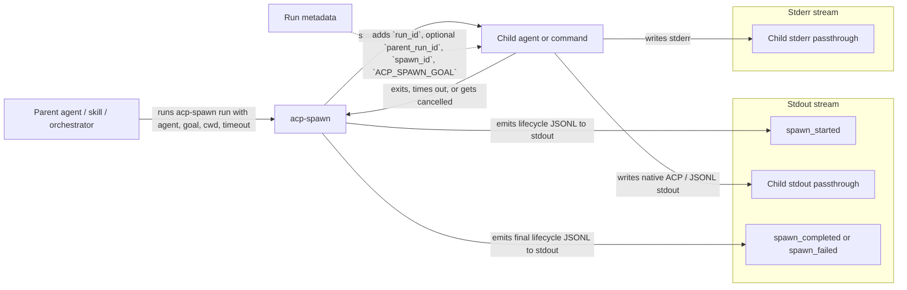

# acp-spawn

`acp-spawn` is a debug tool for inspecting ACP agent invocations. Give it a prompt and an agent, and it will run the agent while printing the full ACP call lifecycle as JSONL — so you can see exactly what happens during the call without digging through logs or wrapping the agent yourself.

## What This Project Does



The key idea is that `acp-spawn` wraps the child process with supervision (timeouts, cancellation, run tracing) and emits lifecycle events, but it does not reinterpret the child's stdout. That keeps the tool focused on its job: you see the raw agent output, with lifecycle metadata injected as structured events you can filter with `jq`.

## Current Capabilities

- Supports `acp-spawn run --agent --goal --cwd [--agent-arg ...] [--timeout-ms ...]`
- Supports `acp-spawn run --config <FILE> [--profile <NAME>]` for config-driven targets
- Adds a small amount of run metadata: `run_id`, optional `parent_run_id`, and `spawn_id`
- Emits strict lifecycle JSONL events on stdout: `spawn_started`, `spawn_completed`, and `spawn_failed`
- Keeps stderr for raw child stderr and human-readable runtime errors
- Supports cancellation and timeout-driven termination
- Passes child stdout through natively without parsing, wrapping, or enriching ACP events

## Scope

`acp-spawn` is a single-purpose debug tool. It stays small so you can trust it to report what happens without getting in the way.

Goals:

- Run any agent or command with a prompt and working directory.
- Emit minimal, strict JSONL lifecycle events for machine inspection.
- Preserve child stdout exactly as emitted — zero transformation.
- Trace nested runs via `run_id` / `parent_run_id` propagation.

Non-goals:

- No trace storage, querying, aggregation, or UI.
- No normalization of non-ACP child stdout into ACP.
- No orchestration (queues, scheduling, retries, concurrency).
- No command hijacking, shell integration, or global install magic.

## Quick Start

```bash
cargo run -- run --config examples/spawn-profiles.toml
```

Example stdout:

```json
{"run_id":"...","timestamp":"...","event":"spawn_started","data":{"spawn_id":"...","agent":"/bin/sh","command":["/bin/sh","-c","printf '{\"event\":\"demo\"}\\n'"],"cwd":"/path/to/repo","timeout_ms":1000,"pid":12345}}
{"event":"demo"}
{"run_id":"...","timestamp":"...","event":"spawn_completed","data":{"spawn_id":"...","duration_ms":12,"exit_code":0,"result":{"status":"success","summary":"agent '/bin/sh' completed successfully","run_id":"...","exit_code":0}}}
```

## Practical Example: Parent And Child Runs

This example simulates a parent agent that already has a `run_id`, then uses `acp-spawn` to run a child process while keeping the relationship visible.

1. Set a parent run in the environment:

```bash
export RUN_ID="run-parent-123"
```

2. Spawn a child that prints the run metadata it received:

```bash
cargo run -- run \
  --agent /bin/sh \
  --agent-arg -c \
  --agent-arg 'printf "{\"event\":\"run_check\",\"run_id\":\"%s\",\"parent_run_id\":\"%s\",\"spawn_id\":\"%s\",\"goal\":\"%s\"}\n" "$RUN_ID" "$PARENT_RUN_ID" "$SPAWN_ID" "$ACP_SPAWN_GOAL"' \
  --goal "child agent does work" \
  --cwd .
```

What you should observe in stdout:

- The first line is the `spawn_started` lifecycle event for the child run.
- The second line is the child's JSON (passed through untouched).
- The child sees its own generated `run_id`.
- The child sees `parent_run_id="run-parent-123"`.
- The child sees a generated `spawn_id`.
- The final line is `spawn_completed` (or `spawn_failed` if it errors).

To quickly extract the child run identifiers:

```bash
cargo run -- run --config examples/spawn-profiles.toml \
  | jq -r 'select(.event=="spawn_started") | "run_id=\(.run_id) spawn_id=\(.data.spawn_id)"'
```

## Config Format

Use `examples/spawn-profiles.toml` as the reference format:

```toml
[run]
agent = "/bin/sh"
agent_args = ["-c", "printf '{\"event\":\"demo\"}\n'"]
goal = "demo success"
cwd = ".."
timeout_ms = 1000

[profiles.opencode-acp]
agent = "opencode"
agent_args = ["acp"]
goal = "serve acp"
cwd = ".."
timeout_ms = 3000
```

The root `[run]` section is used when `--profile` is omitted. Named profiles under `[profiles.<name>]` can be selected with `--profile`.

Relative `cwd` values are resolved relative to the config file location, not the shell working directory.

## Test With `opencode acp`

Run the predefined profile:

```bash
cargo run -- run --config examples/spawn-profiles.toml --profile opencode-acp
```

This is useful as a smoke test:

- stdout contains `acp-spawn` lifecycle JSONL plus the child process stdout lines exactly as emitted
- If `opencode acp` does not exit before the timeout, the runtime emits `spawn_failed`
- Raw child stderr is still forwarded to stderr for debugging

To drive a real ACP request through `acp-spawn`, provide a stdin payload file:

```bash
cargo run -- run --config examples/spawn-profiles.toml --profile opencode-acp --input-file examples/opencode-initialize.jsonl
```

This forwards the file contents to child stdin unchanged while preserving lifecycle events on stdout. With `opencode acp`, the example returns a real `initialize` result.

## Output Contract

- stdout: lifecycle JSONL emitted by `acp-spawn` plus native child stdout passthrough; the MVP assumes child stdout is already ACP or JSONL when machine-readable output is required
- stderr: debug output, human-readable logs, and runtime error messages only
