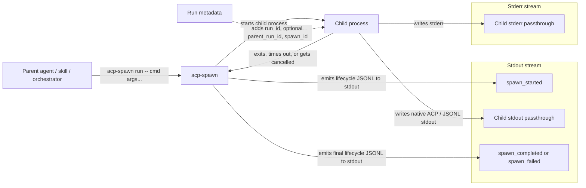

# acp-spawn

`acp-spawn` wraps any command with structured JSONL lifecycle events on stdout, so you can observe exactly what happens during execution without digging through logs.

## What This Project Does



The key idea is that `acp-spawn` wraps the child process with supervision (timeouts, cancellation, run tracing) and emits lifecycle events, but it does not reinterpret the child's stdout. That keeps the tool focused on its job: you see the raw output, with lifecycle metadata injected as structured events you can filter with `jq`.

## Current Capabilities

- Run any command: `acp-spawn run -- <command> [args...]`
- Optional `--cwd <DIR>` to set the working directory
- Adds run metadata: `run_id`, optional `parent_run_id`, and `spawn_id`
- Emits strict lifecycle JSONL events on stdout: `spawn_started`, `spawn_completed`, and `spawn_failed`
- Keeps stderr for raw child stderr and human-readable runtime errors
- Supports cancellation (Ctrl-C) and timeout-driven termination (5 minute default)
- Passes child stdout through natively without parsing, wrapping, or enriching ACP events

## Quick Start

```bash
cargo run -- run -- /bin/sh -c 'printf "{\"event\":\"demo\"}\n"'
```

Example stdout:

```json
{"run_id":"...","timestamp":"...","event":"spawn_started","data":{"spawn_id":"...","agent":"/bin/sh","command":["/bin/sh","-c","printf \"{\\\"event\\\":\\\"demo\\\"}\\n\""],"cwd":"/path/to/repo","timeout_ms":300000,"pid":12345}}
{"event":"demo"}
{"run_id":"...","timestamp":"...","event":"spawn_completed","data":{"spawn_id":"...","duration_ms":6,"exit_code":0,"result":{"status":"success","summary":"agent '/bin/sh' completed successfully","run_id":"...","exit_code":0}}}
```

## Run an ACP Agent

```bash
cargo run -- run -- opencode acp
```

With a custom working directory:

```bash
cargo run -- run --cwd /path/to/project -- opencode acp
```

## Parent And Child Runs

This example simulates a parent agent that already has a `run_id`, then uses `acp-spawn` to run a child process while keeping the relationship visible.

1. Set a parent run in the environment:

```bash
export RUN_ID="run-parent-123"
```

2. Spawn a child that prints the run metadata it received:

```bash
cargo run -- run --cwd . -- \
  /bin/sh -c 'printf "{\"event\":\"run_check\",\"run_id\":\"%s\",\"parent_run_id\":\"%s\",\"spawn_id\":\"%s\"}\n" "$RUN_ID" "$PARENT_RUN_ID" "$SPAWN_ID"'
```

What you should observe in stdout:

- The first line is the `spawn_started` lifecycle event.
- The second line is the child's JSON (passed through untouched).
- The child sees its own generated `run_id`.
- The child sees `parent_run_id="run-parent-123"`.
- The child sees a generated `spawn_id`.
- The final line is `spawn_completed` (or `spawn_failed` if it errors).

To quickly extract the child run identifiers:

```bash
cargo run -- run -- opencode acp \
  | jq -r 'select(.event=="spawn_started") | "run_id=\(.run_id) spawn_id=\(.data.spawn_id)"'
```

## Output Contract

- stdout: lifecycle JSONL emitted by `acp-spawn` plus native child stdout passthrough
- stderr: raw child stderr and runtime error messages only